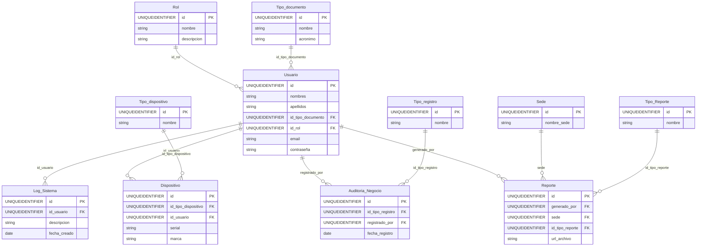

# 05 – Modelo de datos

**Proyecto:** SkilledGuard  
**Documento:** Modelo de datos  
**Referencia:** Resumen de [Base_de_Datos/README.txt](../Base_de_Datos/README.txt) y scripts DDL/DML. La descripción detallada de tablas y relaciones está en ese README.

---

## 1. Resumen

| Aspecto | Valor |
|---------|--------|
| **Nombre de la base de datos** | `auditoria_sistema` |
| **Motor** | Microsoft SQL Server (T-SQL) |
| **Scripts** | `Base_de_Datos/DDL_base_de_datos.sql` (estructura), `Base_de_Datos/DML_base_de_datos.sql` (datos iniciales) |
| **Identificadores** | Todas las tablas usan `UNIQUEIDENTIFIER` (GUID) como clave primaria, con `DEFAULT NEWID()`. |

Documentación completa de tablas, relaciones, índices y permisos: **[Base_de_Datos/README.txt](../Base_de_Datos/README.txt)**.

---

## 2. Tablas

| Tabla | Descripción |
|-------|-------------|
| **Rol** | Catálogo de roles (Administrador, Usuario). Campos: id, nombre, descripcion. |
| **Tipo_documento** | Tipos de documento de identidad (CC, Pasaporte). Campos: id, nombre, acronimo. |
| **Usuario** | Usuarios del sistema. FK a Tipo_documento y Rol. Campos: id, nombres, apellidos, id_tipo_documento, documento, tipo_usuario, email, direccion, contraseña, fecha_creado, fecha_actualizado, id_rol. |
| **Log_Sistema** | Registro de acciones o eventos por usuario. FK a Usuario. Campos: id, id_usuario, descripcion, fecha_creado. |
| **Tipo_dispositivo** | Catálogo (Laptop, Smartphone, etc.). Campos: id, nombre. |
| **Dispositivo** | Dispositivos asociados a usuarios. FK a Tipo_dispositivo y Usuario. Campos: id, serial, marca, modelo, sistema, descripcion, foto_url, qr, id_tipo_dispositivo, id_usuario, fecha_creado, fecha_actualizado. |
| **Tipo_registro** | Catálogo para auditoría (Ingreso, Salida). Campos: id, nombre. |
| **Auditoria_Negocio** | Registros de auditoría de negocio (ingresos/salidas). FK a Tipo_registro y Usuario (registrado_por). Campos: id, fecha_registro, id_tipo_registro, registrado_por, descripcion. |
| **Tipo_Reporte** | Catálogo (Reporte Diario, Reporte Mensual). Campos: id, nombre. |
| **Sede** | Sedes. Campos: id, nombre_sede. |
| **Reporte** | Reportes generados. FK a Usuario (generado_por), Sede y Tipo_Reporte. Campos: id, generado_por, sede, descripcion, fecha_generado, url_archivo, id_tipo_reporte, fecha_creado, fecha_actualizado. |

---

## 3. Relaciones principales

| Entidad origen | Relación | Entidad destino |
|----------------|----------|-----------------|
| Usuario | N:1 | Rol, Tipo_documento |
| Log_Sistema | N:1 | Usuario |
| Dispositivo | N:1 | Tipo_dispositivo, Usuario |
| Auditoria_Negocio | N:1 | Tipo_registro, Usuario (registrado_por) |
| Reporte | N:1 | Usuario (generado_por), Sede, Tipo_Reporte |

---

## 4. Diagrama entidad-relación (Mermaid)

El siguiente diagrama se puede visualizar en entornos que soporten Mermaid (p. ej. GitHub, GitLab, muchas herramientas de documentación).

---

## 5. Índices

- **Definidos en el DDL:** cada tabla tiene clave primaria sobre `id` (UNIQUEIDENTIFIER); SQL Server crea el índice correspondiente.
- **Recomendaciones (opcionales,** no incluidas en el DDL actual): ver [Base_de_Datos/README.txt](../Base_de_Datos/README.txt), sección ÍNDICES (índices sobre id_usuario+fecha_creado en Log_Sistema, id_usuario en Dispositivo, etc.).

---

## 6. Uso de los scripts

1. Ejecutar **primero** `Base_de_Datos/DDL_base_de_datos.sql` para crear la base de datos y las tablas.
2. Ejecutar **después** `Base_de_Datos/DML_base_de_datos.sql` para insertar catálogos y datos de prueba.

Requisito: motor compatible con T-SQL (SQL Server).

---

## Referencias

- [Base_de_Datos/README.txt](../Base_de_Datos/README.txt) – Descripción detallada de tablas, relaciones, ER en texto, permisos
- [01_Vision_y_Alcance](01_Vision_y_Alcance.md)
- [07_Base_de_Datos_Resumen](07_Base_de_Datos_Resumen.md) – Resumen ejecutivo de la base de datos
- Scripts: `Base_de_Datos/DDL_base_de_datos.sql`, `Base_de_Datos/DML_base_de_datos.sql`
