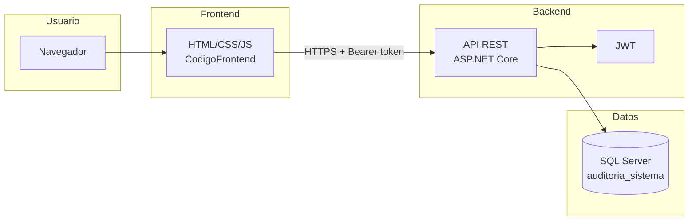
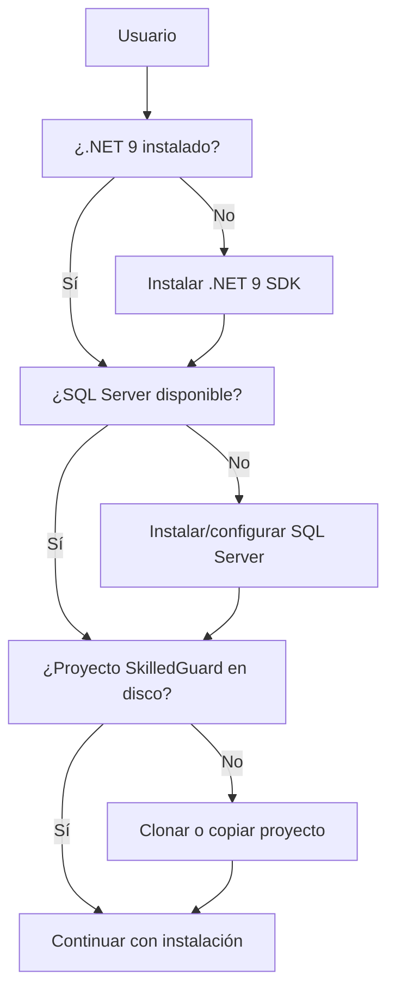
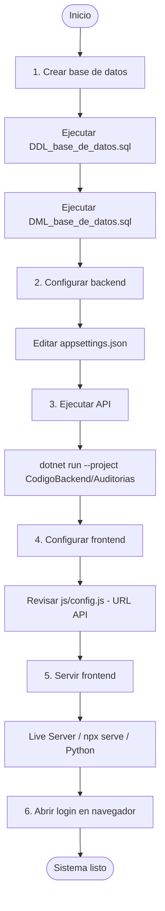
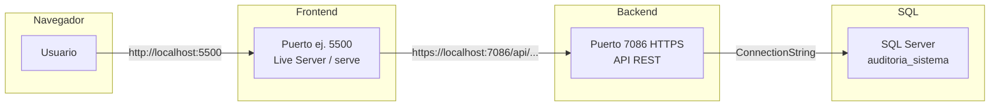
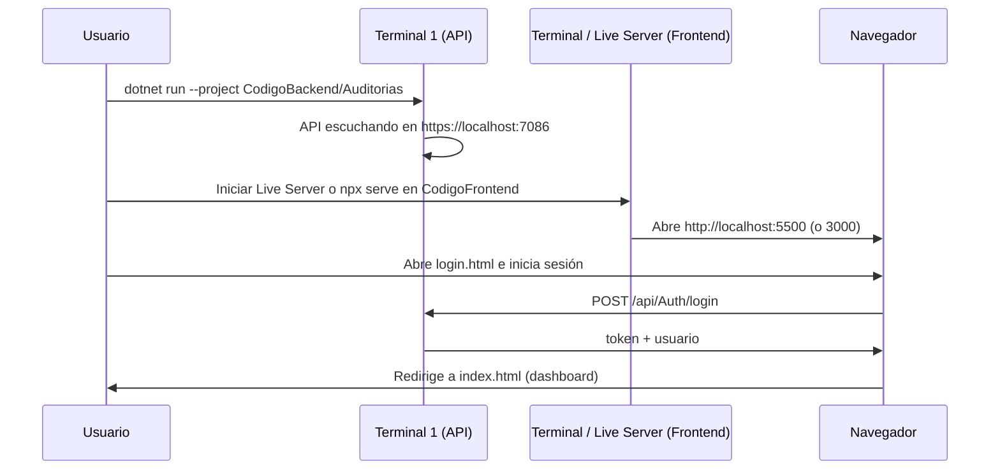
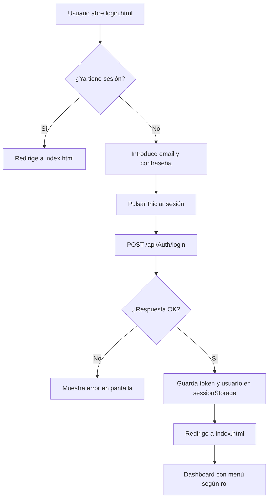

# Manual de usuario – SkilledGuard

**Sistema de auditoría:** instalación, configuración, conexiones y uso  
**Versión del manual:** 1.0  
**Proyecto:** SkilledGuard  

Este manual describe paso a paso cómo instalar, configurar y ejecutar el proyecto SkilledGuard hasta el estado actual, de forma que pueda verse y usarse todo lo que está creado y funcional.

---

## Tabla de contenidos

1. [Introducción](#1-introducción)
2. [Requisitos previos](#2-requisitos-previos)
3. [Estructura del proyecto](#3-estructura-del-proyecto)
4. [Instalación paso a paso](#4-instalación-paso-a-paso)
5. [Configuración detallada](#5-configuración-detallada)
6. [Conexiones y puertos](#6-conexiones-y-puertos)
7. [Ejecución del sistema](#7-ejecución-del-sistema)
8. [Qué está creado y funcional](#8-qué-está-creado-y-funcional)
9. [Verificación y pruebas](#9-verificación-y-pruebas)
10. [Solución de problemas](#10-solución-de-problemas)
11. [Referencias](#11-referencias)

---

## 1. Introducción

**SkilledGuard** es un sistema de auditoría que permite:

- Gestionar **usuarios** con roles (Administrador / Usuario) y autenticación segura (JWT).
- Gestionar **dispositivos** (laptops, smartphones, etc.) asociados a usuarios.
- Registrar **auditoría de negocio** (ingresos/salidas y otros eventos).
- Generar y consultar **reportes** por sede y tipo.
- Mantener **logs del sistema** para trazabilidad.

El sistema consta de tres partes:

| Componente | Descripción |
|------------|-------------|
| **Base de datos** | SQL Server – almacena usuarios, roles, dispositivos, auditorías, reportes y logs. |
| **Backend (API)** | ASP.NET Core 9 – API REST con autenticación JWT, expone Swagger en desarrollo. |
| **Frontend** | HTML, CSS y JavaScript – interfaz web para login, dashboard y navegación por módulos. |

En el siguiente diagrama se resume la arquitectura y el flujo de uso:



---

## 2. Requisitos previos

Antes de comenzar la instalación, verifique que dispone de lo siguiente.

### 2.1 Software necesario

| Requisito | Versión recomendada | Comprobación |
|-----------|---------------------|--------------|
| **.NET SDK** | 9.0 | En terminal: `dotnet --version` (debe mostrar 9.x.x). |
| **SQL Server** | SQL Server 2019 o superior (o Express, LocalDB) | Abrir SQL Server Management Studio o Azure Data Studio y conectar al servidor. |
| **Editor/IDE** | Visual Studio 2022, VS Code o Cursor | Opcional; puede usarse solo la terminal. |
| **Navegador** | Chrome, Firefox, Edge o Safari actualizado | Para usar el frontend y Swagger. |

### 2.2 Conocimientos útiles

- Ejecutar scripts SQL en SQL Server (SSMS o Azure Data Studio).
- Abrir una terminal en la raíz del proyecto (carpeta donde está `SkilledGuard.sln`).
- Editar archivos JSON y JavaScript (por ejemplo `appsettings.json` y `js/config.js`).

### 2.3 Resumen visual de dependencias



---

## 3. Estructura del proyecto

La raíz del proyecto es la carpeta **SkilledGuard** (por ejemplo `C:\Users\...\Documents\SkilledGuard`). Dentro debe verse algo como lo siguiente.

### 3.1 Árbol de carpetas principal

```
SkilledGuard/
├── SkilledGuard.sln          ← Solución de Visual Studio / .NET
├── README.md
├── MANUAL_DE_USUARIO.md     ← Este manual
├── .gitignore
│
├── Base_de_Datos/
│   ├── DDL_base_de_datos.sql   ← Crear base de datos y tablas (ejecutar PRIMERO)
│   ├── DML_base_de_datos.sql   ← Datos iniciales y usuarios de prueba (ejecutar DESPUÉS)
│   └── README.txt
│
├── CodigoBackend/
│   ├── Auditorias/             ← Proyecto API (ASP.NET Core)
│   │   ├── Auditorias.csproj
│   │   ├── Program.cs
│   │   ├── appsettings.json    ← Cadena de conexión y JWT (EDITAR)
│   │   ├── appsettings.Development.json
│   │   ├── Controllers/        ← Endpoints de la API
│   │   ├── Data/               ← AuditoriaContext (EF Core)
│   │   ├── Models/
│   │   └── Properties/
│   │       └── launchSettings.json  ← URLs y puertos de la API
│   └── Dependencias.txt
│
├── CodigoFrontend/
│   ├── index.html              ← Página principal (dashboard) tras login
│   ├── login.html              ← Pantalla de inicio de sesión
│   ├── usuarios.html
│   ├── dispositivos.html
│   ├── auditoria.html
│   ├── reportes.html
│   ├── css/
│   ├── js/
│   │   ├── config.js           ← URL de la API (EDITAR si cambia el puerto)
│   │   ├── api.js
│   │   ├── auth.js
│   │   └── pages/
│   └── assets/
│
└── Documentacion/              ← Documentación técnica del proyecto
```

### 3.2 Flujo de instalación (resumen)



---

## 4. Instalación paso a paso

Siga los pasos en el orden indicado.

---

### Paso 1: Abrir o clonar el proyecto

1. Abra la carpeta **SkilledGuard** en su equipo (por ejemplo `C:\Users\jolaya\Documents\SkilledGuard`).
2. En terminal, navegue a la raíz del proyecto:
   ```powershell
   cd C:\Users\jolaya\Documents\SkilledGuard
   ```
3. Compruebe que existe el archivo `SkilledGuard.sln`:
   ```powershell
   dir SkilledGuard.sln
   ```

---

### Paso 2: Crear la base de datos en SQL Server

La base de datos se crea ejecutando dos scripts SQL **en este orden**.

#### 2.1 Conectar a SQL Server

- Abra **SQL Server Management Studio (SSMS)** o **Azure Data Studio**.
- Conéctese a su instancia de SQL Server (por ejemplo `localhost\SQLEXPRESS` o `DESKTOP-XXX\SQLEXPRESS`).
- Anote el **nombre del servidor** (lo usará en la cadena de conexión del backend).  
  Ejemplo: `DESKTOP-DELL-JC\SQLEXPRESS`.

#### 2.2 Ejecutar el script DDL (crear base de datos y tablas)

1. En SSMS o Azure Data Studio, abra el archivo:
   ```
   SkilledGuard\Base_de_Datos\DDL_base_de_datos.sql
   ```
2. Ejecute el script completo (F5 o botón “Ejecutar”).
3. Verifique que no haya errores y que exista la base de datos `auditoria_sistema` en el explorador de objetos.

**Contenido del DDL (resumen):** crea la base de datos `auditoria_sistema` y las tablas: `Rol`, `Tipo_documento`, `Usuario`, `Log_Sistema`, `Tipo_dispositivo`, `Dispositivo`, `Tipo_registro`, `Auditoria_Negocio`, `Tipo_Reporte`, `Sede`, `Reporte`.

#### 2.3 Ejecutar el script DML (datos iniciales)

1. Abra el archivo:
   ```
   SkilledGuard\Base_de_Datos\DML_base_de_datos.sql
   ```
2. Asegúrese de estar usando la base de datos `auditoria_sistema` (en SSMS puede seleccionarla en el desplegable).
3. Ejecute el script completo.

**Contenido del DML (resumen):** inserta roles (Administrador, Usuario), tipos de documento, tipos de dispositivo, tipos de registro, tipos de reporte, sedes, **dos usuarios de prueba** (ver tabla más abajo), y datos de ejemplo en logs, dispositivos, auditorías y reportes.

| Usuario de prueba | Email | Contraseña | Rol |
|-------------------|-------|------------|-----|
| Juan Pérez        | juan@correo.com       | clave123 | Administrador |
| Ana Gómez         | ana@correo.com        | clave456 | Usuario      |
| Admin Sistema     | admin@skilledguard.com | admin123 | Administrador |
| Usuario Prueba    | usuario@skilledguard.com | user123 | Usuario      |

#### 2.4 Comprobar que la base de datos tiene datos

En SSMS o Azure Data Studio, ejecute por ejemplo:

```sql
USE auditoria_sistema;
SELECT id, nombres, apellidos, email FROM Usuario;
```

Debe ver al menos dos filas (Juan y Ana).

---

### Paso 3: Configurar el backend (API)

La API necesita la **cadena de conexión** a SQL Server y la configuración **JWT**.

#### 3.1 Ubicar el archivo de configuración

Abra en un editor el archivo:

```
SkilledGuard\CodigoBackend\Auditorias\appsettings.json
```

#### 3.2 Ajustar la cadena de conexión

Busque la sección `ConnectionStrings` y modifique `AuditoriaConnection` para que coincida con **su** servidor SQL:

- **Servidor:** el mismo que usó para conectar en SSMS (por ejemplo `DESKTOP-DELL-JC\SQLEXPRESS` o `localhost\SQLEXPRESS`).
- **Base de datos:** `auditoria_sistema`.
- **Autenticación Windows (recomendado en desarrollo):**  
  `Trusted_Connection=True;TrustServerCertificate=True;`

Ejemplo (sustituya `TU_SERVIDOR` por el nombre real de su instancia):

```json
{
  "ConnectionStrings": {
    "AuditoriaConnection": "Server=TU_SERVIDOR;Database=auditoria_sistema;Trusted_Connection=True;TrustServerCertificate=True;"
  },
  ...
}
```

Ejemplo con instancia nombrada típica en Windows:

```json
"AuditoriaConnection": "Server=DESKTOP-DELL-JC\\SQLEXPRESS;Database=auditoria_sistema;Trusted_Connection=True;TrustServerCertificate=True;"
```

#### 3.3 Revisar la configuración JWT (opcional)

En el mismo `appsettings.json` puede revisar (o dejar por defecto en desarrollo):

- **Jwt:Key:** clave secreta para firmar el token. En producción debe ser larga y segura y no subirla al repositorio.
- **Jwt:Issuer:** emisor del token (por ejemplo `"SkilledGuard"` o `"AuditoriasProject"`).

No es necesario cambiarlos para que el sistema funcione en desarrollo.

---

### Paso 4: Restaurar dependencias y compilar el backend

En la terminal, desde la **raíz del proyecto** (donde está `SkilledGuard.sln`):

```powershell
cd C:\Users\jolaya\Documents\SkilledGuard
dotnet restore
dotnet build
```

Si todo va bien, verá “Build succeeded” (o equivalente). Si hay errores, compruebe que tiene .NET 9 instalado (`dotnet --version`) y que la ruta al proyecto es correcta.

---

### Paso 5: Configurar la URL de la API en el frontend

El frontend debe conocer la URL donde corre la API (backend).

1. Abra el archivo:
   ```
   SkilledGuard\CodigoFrontend\js\config.js
   ```
2. Verifique o edite la constante `API_BASE_URL`. Por defecto la API se ejecuta en **HTTPS** en el puerto **7086**:

   ```javascript
   const API_BASE_URL = 'https://localhost:7086';
   ```

3. Si en el paso siguiente la API se ejecuta en **otro puerto** (la consola lo mostrará), cambie aquí el puerto para que coincida. Por ejemplo:
   ```javascript
   const API_BASE_URL = 'https://localhost:7045';  // usar el puerto que muestre la API
   ```

No debe haber barra final en la URL (`https://localhost:7086` y no `https://localhost:7086/`).

---

### Paso 6: (Opcional) Configurar CORS en el backend

Si el frontend se sirve desde un **origen distinto** al de la API (por ejemplo frontend en `http://localhost:5500` y API en `https://localhost:7086`), el navegador puede bloquear las peticiones por CORS.

Si al abrir el frontend y hacer login ve errores de CORS en la consola del navegador (F12):

1. Abra `CodigoBackend\Auditorias\Program.cs`.
2. Antes de `var app = builder.Build();`, añada por ejemplo:

   ```csharp
   builder.Services.AddCors(options =>
   {
       options.AddDefaultPolicy(policy =>
       {
           policy.WithOrigins("http://localhost:5500", "http://127.0.0.1:5500", "http://localhost:3000")
                 .AllowAnyHeader()
                 .AllowAnyMethod();
       });
   });
   ```

3. Después de `var app = builder.Build();` y antes de `app.UseHttpsRedirection();`, añada:

   ```csharp
   app.UseCors();
   ```

Ajuste los orígenes (`WithOrigins`) al puerto desde el que sirva el frontend (Live Server suele usar 5500, `npx serve` puede usar 3000).

---

## 5. Configuración detallada

### 5.1 Archivos de configuración del backend

| Archivo | Ubicación | Qué configurar |
|---------|-----------|------------------|
| appsettings.json | CodigoBackend/Auditorias/ | ConnectionStrings:AuditoriaConnection, Jwt:Key, Jwt:Issuer |
| appsettings.Development.json | CodigoBackend/Auditorias/ | Opcional; sobrescribe valores en desarrollo |
| launchSettings.json | CodigoBackend/Auditorias/Properties/ | applicationUrl (puerto; por defecto 7086 HTTPS, 5164 HTTP) |

### 5.2 Archivos de configuración del frontend

| Archivo | Ubicación | Qué configurar |
|---------|-----------|------------------|
| config.js | CodigoFrontend/js/ | API_BASE_URL: debe ser la URL base del backend (ej. https://localhost:7086) |

### 5.3 Usuarios de prueba (DML)

Tras ejecutar el DML, puede iniciar sesión con cualquiera de estos **4 usuarios**:

| Email | Contraseña | Rol |
|-------|------------|-----|
| juan@correo.com       | clave123 | Administrador |
| ana@correo.com        | clave456 | Usuario      |
| admin@skilledguard.com | admin123 | Administrador |
| usuario@skilledguard.com | user123 | Usuario      |

El rol **Administrador** ve en el menú la opción **Usuarios**; el rol **Usuario** no.

**Nota:** Si el login falla (credenciales inválidas), es posible que la base de datos tenga contraseñas en texto plano de una versión anterior. Ejecute el script `Base_de_Datos/DML_actualizar_contraseñas.sql` para actualizar los hashes.

---

## 6. Conexiones y puertos

### 6.1 Esquema de conexiones



### 6.2 Puertos por defecto

| Servicio | Puerto / URL | Dónde se define |
|----------|--------------|------------------|
| API (HTTPS) | https://localhost:7086 | CodigoBackend/Auditorias/Properties/launchSettings.json |
| API (HTTP)  | http://localhost:5164  | Mismo archivo |
| Swagger     | http://localhost:5164/swagger o https://localhost:7086/swagger | Se abre automáticamente al ejecutar la API |
| Frontend (Live Server) | http://127.0.0.1:5500 o 5500 | Extensión Live Server |
| Frontend (npx serve)   | http://localhost:3000  | Comando `npx serve` |

### 6.3 Cadena de conexión (resumen)

- **Base de datos:** `auditoria_sistema`
- **Servidor:** el que use en su máquina (ej. `.\SQLEXPRESS` o `DESKTOP-XXX\SQLEXPRESS`)
- **Ejemplo completa:**  
  `Server=DESKTOP-DELL-JC\SQLEXPRESS;Database=auditoria_sistema;Trusted_Connection=True;TrustServerCertificate=True;`

---

## 7. Ejecución del sistema

Siga este orden cada vez que quiera usar SkilledGuard.

### 7.1 Arrancar la API (backend)

1. Abra una terminal y vaya a la raíz del proyecto:
   ```powershell
   cd C:\Users\jolaya\Documents\SkilledGuard
   ```
2. Ejecute:
   ```powershell
   dotnet run --project CodigoBackend/Auditorias/Auditorias.csproj
   ```
3. Espere a que aparezca un mensaje indicando que la aplicación está escuchando, por ejemplo:
   ```
   Now listening on: https://localhost:7086
   Now listening on: http://localhost:5164
   ```
4. Anote la URL HTTPS (normalmente `https://localhost:7086`). Si es otra, actualice `CodigoFrontend/js/config.js` como en el Paso 5 de la instalación.

**Alternativa con Visual Studio:** abra `SkilledGuard.sln`, establezca **Auditorias** como proyecto de inicio y pulse **F5**.

No cierre esta terminal mientras use el sistema; la API debe seguir en ejecución.

### 7.2 Servir el frontend

El frontend son archivos estáticos (HTML/CSS/JS). Debe servirse por **HTTP** (no abrir los archivos directamente con `file://`) para evitar problemas con fetch y CORS.

**Opción A – Live Server (recomendado en VS Code / Cursor)**  
1. Abra la carpeta `CodigoFrontend` en el editor.  
2. Instale la extensión “Live Server” si no la tiene.  
3. Clic derecho en `index.html` o `login.html` → “Open with Live Server”.  
4. Se abrirá el navegador en una URL como `http://127.0.0.1:5500` o `http://localhost:5500`.

**Opción B – npx serve (Node.js)**  
Desde la raíz del proyecto:

```powershell
cd CodigoFrontend
npx serve . -l 3000
```

Abra en el navegador: `http://localhost:3000`.

**Opción C – Python**  
```powershell
cd CodigoFrontend
python -m http.server 8000
```

Abra: `http://localhost:8000`.

### 7.3 Orden de arranque recomendado



1. Primero: arrancar la API (terminal con `dotnet run ...`).  
2. Después: servir el frontend (Live Server o `npx serve`).  
3. Por último: abrir en el navegador la URL del frontend (por ejemplo `http://127.0.0.1:5500/login.html`).

---

## 8. Qué está creado y funcional

Resumen de lo que puede usarse hoy.

### 8.1 Base de datos

- Base de datos `auditoria_sistema` creada con el DDL.
- Tablas: Rol, Tipo_documento, Usuario, Log_Sistema, Tipo_dispositivo, Dispositivo, Tipo_registro, Auditoria_Negocio, Tipo_Reporte, Sede, Reporte.
- Datos iniciales y cuatro usuarios de prueba (Juan, Ana, Admin, Usuario Prueba) tras ejecutar el DML.

### 8.2 Backend (API)

- **Login:** `POST /api/Auth/login` con email y contraseña; devuelve token JWT y datos del usuario.
- **Endpoints protegidos** (requieren header `Authorization: Bearer <token>`): usuarios, roles, tipos de documento, dispositivos, tipos de dispositivo, auditoría de negocio, tipos de registro, sedes, tipos de reporte, reportes, logs.
- **Swagger:** en desarrollo, se abre automáticamente al ejecutar la API en `http://localhost:5164/swagger` o `https://localhost:7086/swagger`. Permite explorar y probar todos los endpoints.

### 8.3 Frontend

| Página | Ruta | Estado | Descripción |
|--------|------|--------|-------------|
| Login | login.html | Funcional | Formulario email/contraseña; llama a la API, guarda token y usuario y redirige a index.html. |
| Inicio (dashboard) | index.html | Funcional | Comprueba sesión, muestra nombre y rol del usuario, menú de navegación y “Cerrar sesión”. El enlace “Usuarios” solo se muestra para rol Administrador. |
| Usuarios | usuarios.html | Estructura lista | Página con menú; contenido de listado/CRUD “en desarrollo”. |
| Dispositivos | dispositivos.html | Estructura lista | Igual; contenido “en desarrollo”. |
| Auditoría de negocio | auditoria.html | Estructura lista | Igual; contenido “en desarrollo”. |
| Reportes | reportes.html | Estructura lista | Igual; contenido “en desarrollo”. |

**Funcionalidad actual del frontend:**

- Iniciar sesión con cualquiera de los 4 usuarios: `juan@correo.com` / `clave123`, `ana@correo.com` / `clave456`, `admin@skilledguard.com` / `admin123`, `usuario@skilledguard.com` / `user123`.
- Tras el login, redirección al dashboard (index.html).
- Menú común en todas las páginas; “Usuarios” solo visible para Administrador.
- Cerrar sesión (borra token y redirige a login).
- Protección de páginas: si no hay token, redirección a login.

### 8.4 Diagrama de flujo de login (frontend)



---

## 9. Verificación y pruebas

### 9.1 Comprobar la API con Swagger

1. Ejecute la API con `dotnet run --project CodigoBackend/Auditorias`. Swagger se abrirá automáticamente. Si no, abra manualmente: `http://localhost:5164/swagger` o `https://localhost:7086/swagger`
2. En Swagger, localice **Auth** → **POST /api/Auth/login**.
3. “Try it out”, body por ejemplo:
   ```json
   {
     "email": "juan@correo.com",
     "contraseña": "clave123"
   }
   ```
5. Execute. Debe recibir una respuesta 200 con `token` y `usuario` (nombres, apellidos, email, rol).

### 9.2 Comprobar el frontend (login y dashboard)

1. API en ejecución y frontend servido (Live Server o similar).
2. Abra en el navegador la URL del frontend (ej. `http://127.0.0.1:5500/login.html`).
3. Si le redirige a `index.html` es que ya tenía sesión; en ese caso abra `login.html` de nuevo o cierre sesión.
4. Introduzca:
   - Email: `juan@correo.com`
   - Contraseña: `clave123`
5. Pulse “Iniciar sesión”. Debe ir a la página de inicio (dashboard) y ver su nombre y “Administrador”.
6. Compruebe el menú: debe verse el enlace “Usuarios”.
7. Pulse “Cerrar sesión”: debe volver a login.
8. Inicie sesión con `ana@correo.com` / `clave456`. El enlace “Usuarios” no debe mostrarse (rol Usuario).

### 9.3 Probar la API con Postman

1. Importe la colección desde `Postman/SkilledGuard_API.postman_collection.json`.
2. Configure la variable `baseUrl` (por defecto `http://localhost:5164`; si usa HTTPS, use `https://localhost:7086`).
3. Ejecute primero **Auth → Login**; el token se guarda automáticamente en la variable `token`.
4. Ejecute cualquier otro endpoint; el token se envía en el header `Authorization` automáticamente.

### 9.4 Checklist rápido

- [ ] Base de datos `auditoria_sistema` existe y tiene datos (al menos 4 usuarios de prueba).
- [ ] `appsettings.json` tiene la cadena de conexión correcta para su servidor.
- [ ] `dotnet build` termina sin errores.
- [ ] La API arranca y muestra “Now listening on: https://localhost:7086” (o su puerto).
- [ ] `CodigoFrontend/js/config.js` tiene la misma URL que la que usa la API (incluido puerto).
- [ ] El frontend se abre por HTTP (no file://).
- [ ] Login con juan@correo.com / clave123 lleva al dashboard y muestra “Usuarios” en el menú.
- [ ] Cerrar sesión vuelve a login.

---

## 10. Solución de problemas

### Error: no se puede conectar a la base de datos

- Compruebe que SQL Server está en ejecución (Servicios de Windows o SSMS).
- Verifique el nombre del servidor en `appsettings.json` (incluida la instancia, ej. `\SQLEXPRESS`).
- Para autenticación Windows: `Trusted_Connection=True`.
- Pruebe la conexión desde SSMS con el mismo servidor y base de datos.

### Error: “Credenciales incorrectas” al hacer login

- Confirme que ejecutó el script **DML_base_de_datos.sql** (usuarios de prueba).
- Use exactamente: `juan@correo.com` y `clave123` (o `ana@correo.com` y `clave456`).
- En la API, las contraseñas se comparan con hash; si modificó el DML, asegúrese de que la contraseña en base de datos coincida con lo que usa el backend (PasswordHelper).

### El frontend no carga o “Failed to fetch” / CORS

- Compruebe que la **API está en ejecución** y que la URL en `config.js` es la correcta (incluido `https://` y el puerto).
- No abra el frontend con `file://`; use un servidor (Live Server, `npx serve`, etc.).
- Si aparece error de CORS en la consola del navegador (F12), configure CORS en el backend como en el Paso 6 de la instalación, con el origen desde el que sirve el frontend.

### La API usa otro puerto

- Al ejecutar `dotnet run`, la consola muestra la URL (ej. `https://localhost:7045`). Copie esa URL (sin barra final) en `CodigoFrontend/js/config.js` como `API_BASE_URL`.

### Swagger no abre o 404

- Swagger solo está habilitado en entorno **Development**. Compruebe que ejecuta sin `ASPNETCORE_ENVIRONMENT=Production`.
- La API está configurada para abrir Swagger automáticamente al iniciar. Si no ocurre, abra manualmente: `http://localhost:5164/swagger` o `https://localhost:7086/swagger` (según el perfil usado).

---

## 11. Referencias

- **README.md** (raíz del proyecto): descripción general, tecnologías y pasos básicos.
- **Documentacion/08_Guia_Desarrollo.md**: guía de desarrollo (requisitos, BD, configuración, ejecución).
- **Documentacion/09_Configuracion_Entornos.md**: entornos, CORS, JWT, cadenas de conexión.
- **Documentacion/06_API_Endpoints.md**: listado de endpoints de la API.
- **Postman/SkilledGuard_API.postman_collection.json**: colección de Postman para pruebas de la API.
- **CodigoFrontend/README.md**: detalle del frontend (estructura, integración con la API, pantallas).
- **Base_de_Datos/README.txt**: descripción de tablas y uso de los scripts DDL/DML.

---

*Fin del manual. Para cualquier ampliación o cambio en el proyecto, actualice este documento y la documentación en la carpeta Documentacion.*
