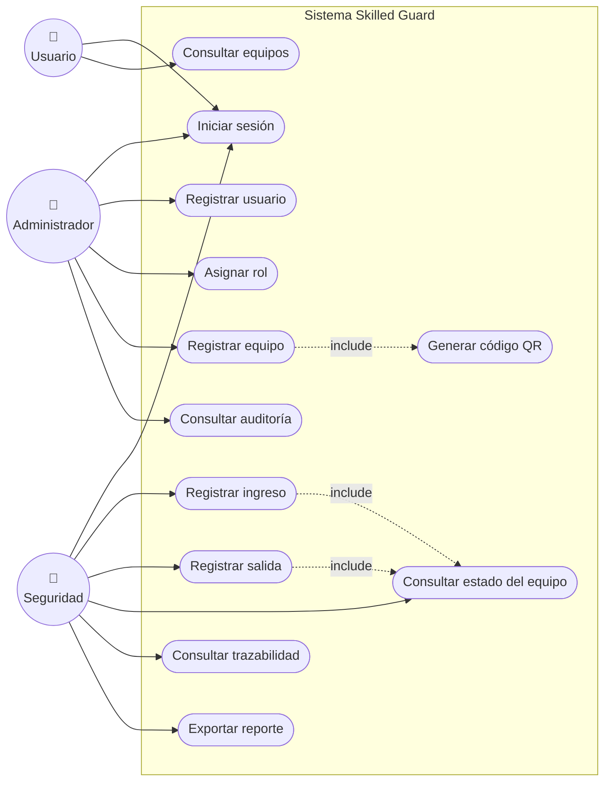
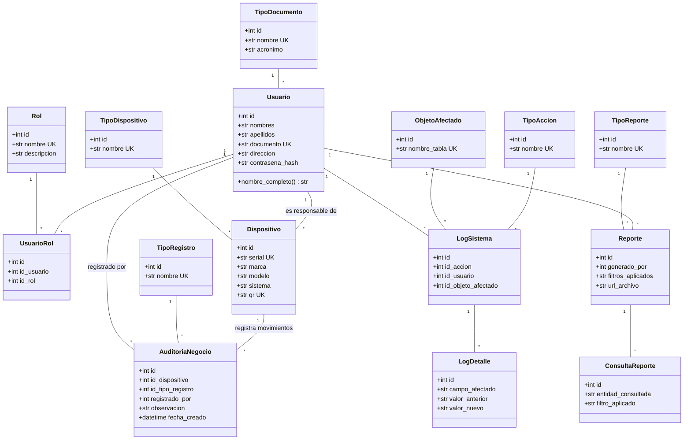
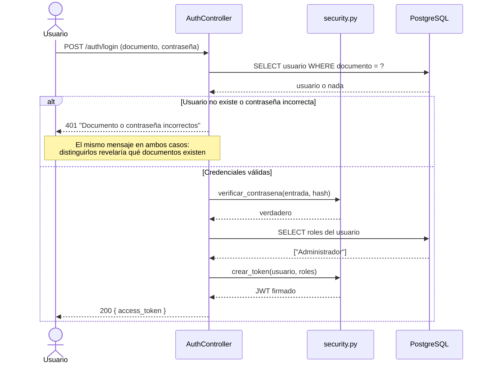
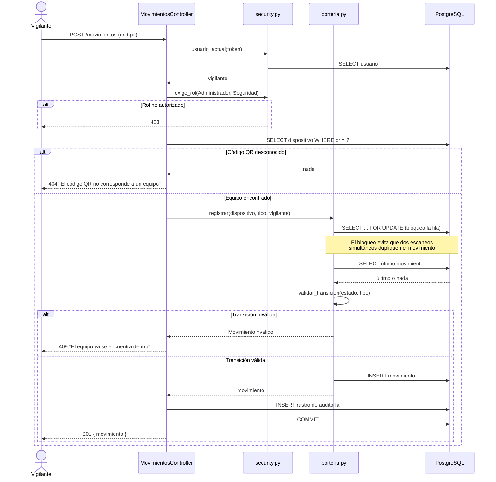
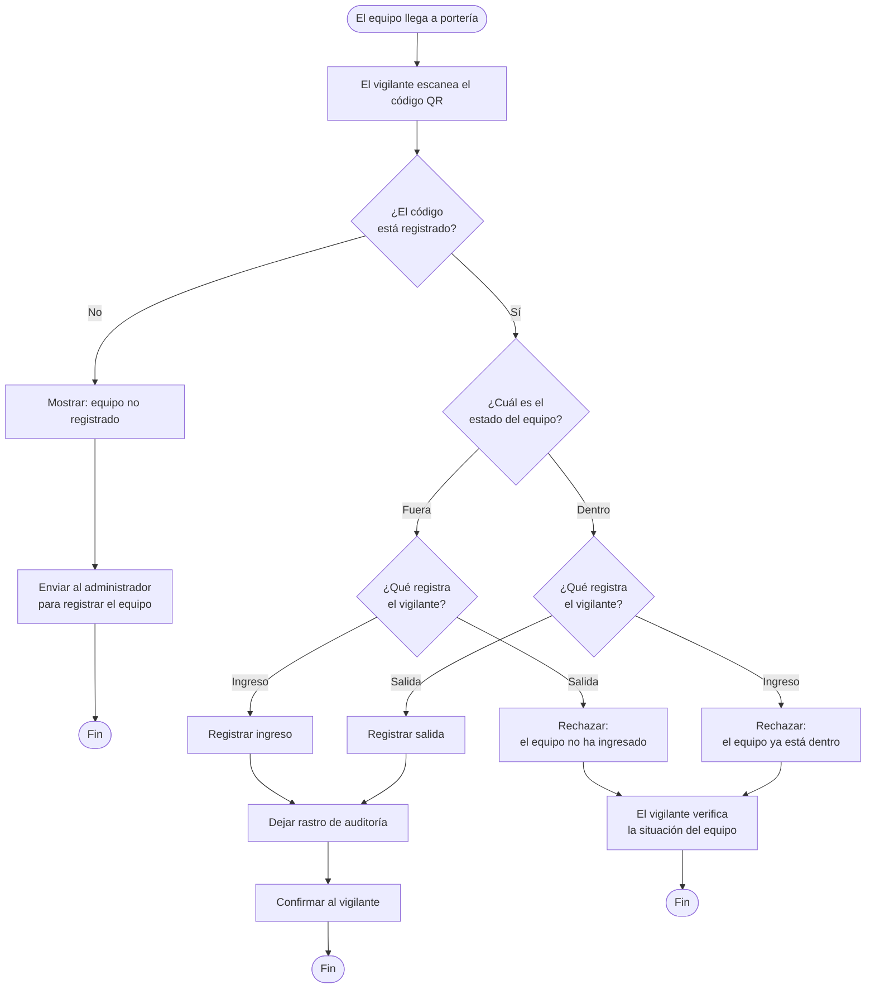
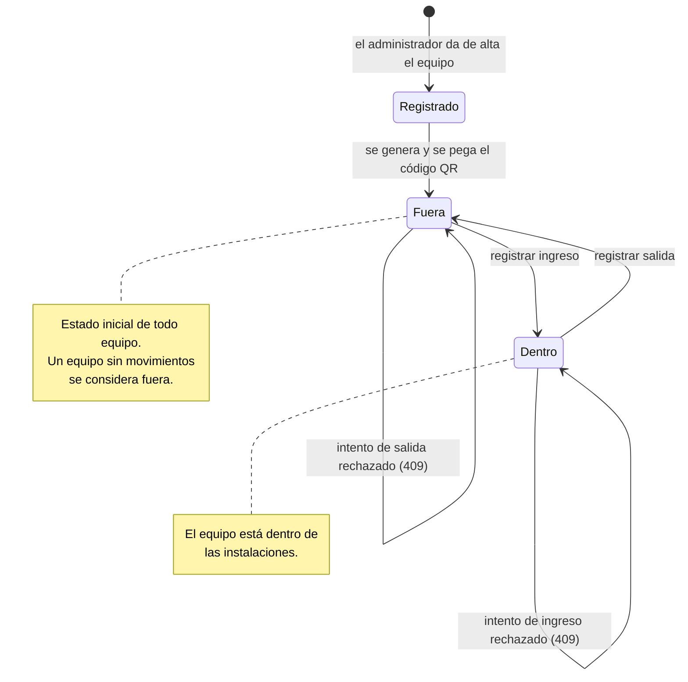
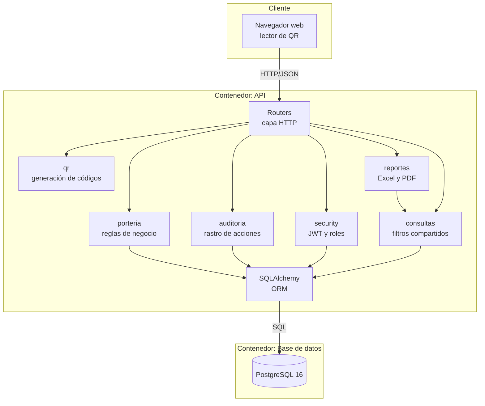
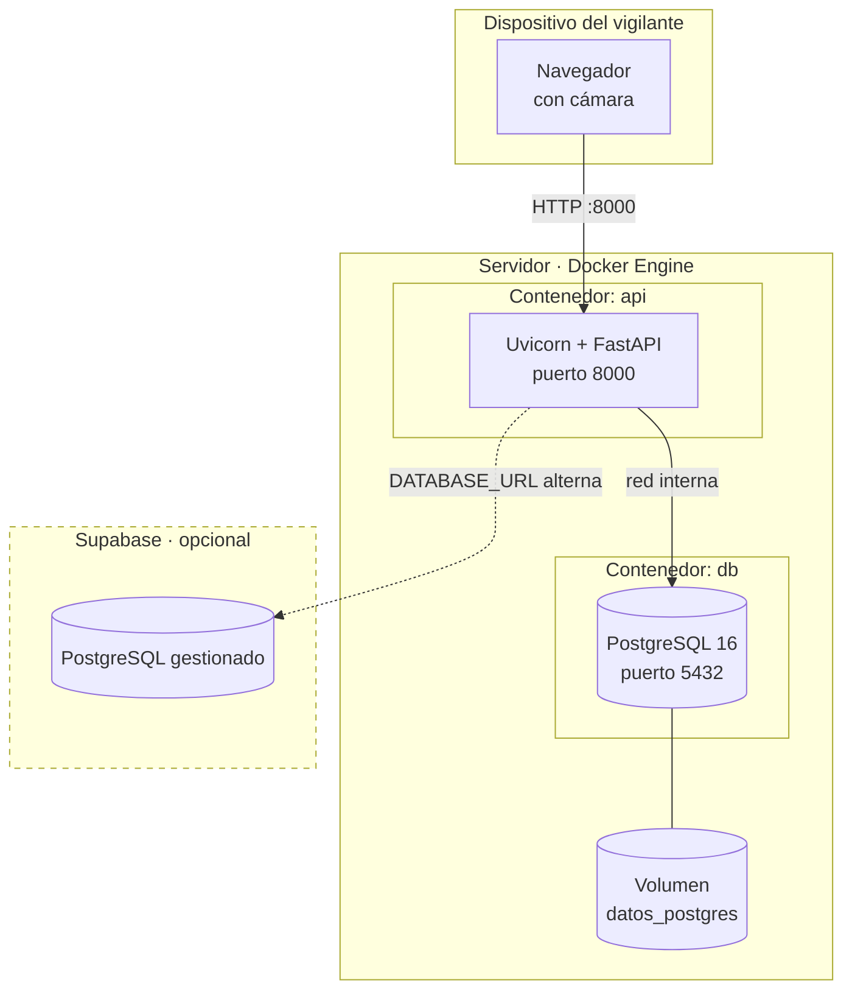

# Diagramas UML

**Proyecto:** Skilled Guard

Ocho diagramas de siete tipos distintos: el de secuencia aparece dos veces, una por cada flujo crítico (inicio de sesión y validación en portería).

UML 2.5 define catorce tipos. Se incluyen los siete que aportan información que los demás no dan; los omitidos se listan al final con el motivo. Preferir siete diagramas que digan algo antes que catorce por completar el conteo.

---

## 1. Casos de uso

Qué puede hacer cada actor.

**Nota sobre las relaciones `include`:** registrar un equipo genera siempre su código QR, y registrar un movimiento consulta siempre el estado actual para validar la transición. No son pasos opcionales.

---

## 2. Clases

Las 15 entidades del modelo y sus relaciones.

**`UK`** indica restricción de unicidad. `Dispositivo.qr` es única porque es el identificador que la portería escanea: dos equipos con el mismo código harían imposible saber cuál se movió.

---

## 3. Secuencia — Inicio de sesión

---

## 4. Secuencia — Validación en portería

El flujo central del sistema.

---

## 5. Actividad — Ingreso y salida de un equipo

---

## 6. Estados — Ciclo de vida de un equipo

Las transiciones reflexivas (`Fuera → Fuera`, `Dentro → Dentro`) representan los intentos rechazados: el sistema responde, pero **el estado no cambia y no se registra ningún movimiento**. Son la representación de los requerimientos RF-14 y RF-15.

---

## 7. Componentes

`consultas` lo usan tanto los endpoints como los reportes: es lo que garantiza que el Excel y la pantalla muestren exactamente lo mismo ante los mismos filtros.

---

## 8. Despliegue

**Dos modos de despliegue.** En local, la base de datos corre en su propio contenedor con un volumen persistente — el sistema funciona sin internet, lo que importa porque la portería puede quedarse sin conexión. Cambiando `DATABASE_URL` la misma API apunta a PostgreSQL gestionado en Supabase, sin tocar el código.

---

## Diagramas omitidos y por qué

| Diagrama | Motivo |
|---|---|
| Comunicación | Muestra la misma información que los de secuencia, con otra disposición |
| Objetos | Una instantánea de instancias no agrega nada sobre el diagrama de clases en un modelo de este tamaño |
| Paquetes | La estructura de módulos ya se ve en el diagrama de componentes |
| Tiempos | No hay restricciones temporales que modelar |
| Estructura compuesta | Ningún componente tiene partes internas colaborando entre sí |
| Perfil | Sirve para extender el propio UML; no aplica |
| Vista general de interacción | Solo se justifica al coordinar muchos diagramas de secuencia |
